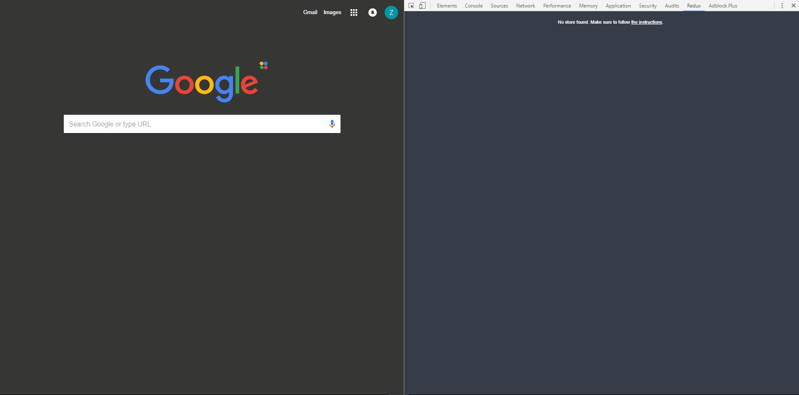
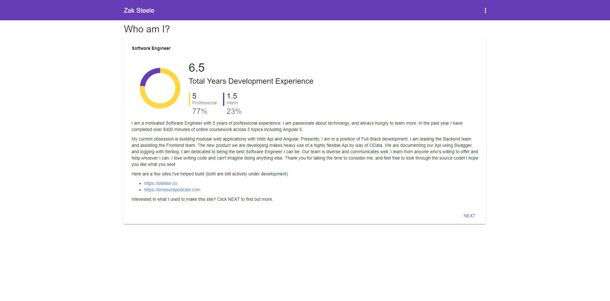
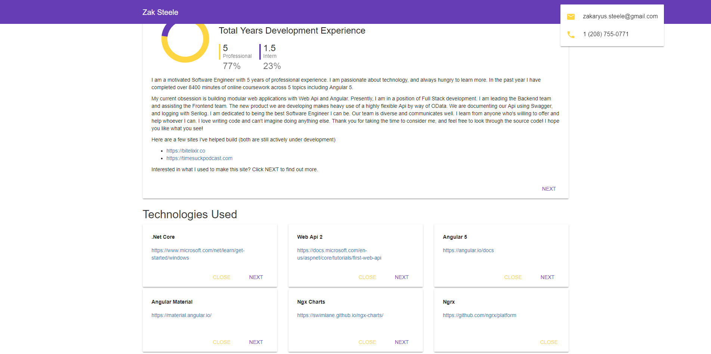
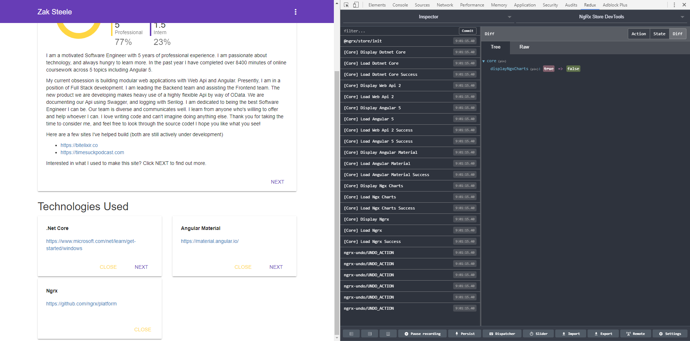

# Intellitect
.Net Core/Angular 5 Demo

I have had multiple developers run in to issues when attempting to get .Net Core projects running for the first time. If you plan on pulling this repo to compile and run it, there are a few things to make sure you have installed

* Visual Studio 2017 Version 15.3.0 or higher (I'm on 15.3.4 Community)
* Node.js Version 8 or higher (I'm on 8.9.1)
* .Net Core Version 2 or higher (I'm on 2.0.3)
* Angular CLI Version 1.6 or higher (I'm on 1.6.3)

That may not be a fully exhaustive list. 
In production builds that are also additional requirements.
Lastly, make sure and restart after installing .Net Core.
If you don't plan to build, you can just check out the screenshots below!

